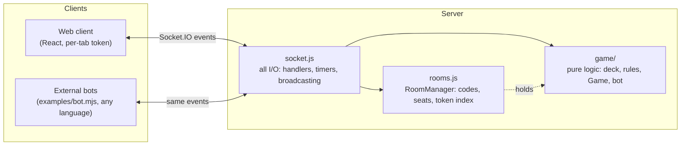

# ARCHITECTURE.md

How the UNO multiplayer game is put together: the layers, the invariants that
hold them apart, and where to make common kinds of changes. Companion docs:
[README](README.md) (running it), [docs/API.md](docs/API.md) (the socket
protocol), [MEMORY.md](MEMORY.md) (environment quirks and hard-won lessons).

## Bird's-eye view

An npm-workspaces monorepo with two packages — `server` (Node, Express +
Socket.IO, ESM) and `client` (React 18 + Vite). **The server is authoritative:**
clients never see other players' hands, every move is validated server-side, and
the only channel between the two sides is Socket.IO events. The client is a pure
view of server state; it holds no game truth of its own.



Both the web client and external bots speak the identical protocol — the socket
contract is a public API (see `docs/API.md`).

## Codemap

```
server/src/
  game/            pure game logic — no sockets, no timers, no I/O
    deck.js          108-card deck builder + Fisher-Yates shuffle
    rules.js         card-match predicates (canPlay, canJumpIn) + card naming
    game.js          Game: the turn engine; GameError; per-viewer stateFor()
    bot.js           botAction(game, id) -> {type, cardId, color}; never mutates
  rooms.js         RoomManager: 4-letter codes, seats, token -> room index
  socket.js        every Socket.IO concern: handlers, bot/UNO/grace timers,
                   broadcasting, room lifecycle
  index.js         HTTP server; statically serves client/dist when it exists
server/test/       vitest unit tests for deck, rules, and the turn engine

client/src/
  App.jsx          owns ALL state, fed only by socket events; picks the screen
  socket.js        socket singleton + per-tab session token (sessionStorage)
  rules.js         mirror of server rules for UI highlighting ONLY
  audioCore.js     shared AudioContext singleton + autoplay unlock (sfx + bgm)
  sfx.js           synthesized Web Audio sound effects + mute persistence
  bgm.js           generative adaptive music engine (intensity-driven layers)
  components/      Home -> Lobby -> GameTable (Hand, Card, OpponentSeat, ...)
                   plus ChatPanel, EventToast, MuteButton, MusicButton

docs/API.md        socket protocol reference for external bot authors
examples/bot.mjs   standalone reference bot exercising the whole API
```

## The server, layer by layer

### `game/` — pure logic

The `Game` class is a synchronous state machine. Its contract:

- **Invalid moves throw `GameError`** with a user-facing message. Anything else
  thrown is a bug.
- **Commentary accumulates** via `event(text)` and is drained by the caller with
  `takeEvents()`. Events are display strings, never protocol — clients must not
  parse them for behavior.
- **`stateFor(viewerId)` is the only way state leaves the class.** It includes
  the viewer's own hand and only `cardCount` for everyone else. Nothing else
  should serialize a `Game`.
- No knowledge of sockets, timers, or rooms. This is what makes the turn engine
  unit-testable (`server/test/`) and lets `bot.js` run against a live `Game`
  directly.

`bot.js` is a pure decision function over a `Game` + seat id — it scores
playable cards (dump matching colors, save wilds, punish a low-card opponent
with action cards) and returns an action without mutating anything. The
*scheduling* of bot turns lives in `socket.js`.

### `rooms.js` — seats and identity

`RoomManager` owns two maps: room code → room, and session token → room code.
Rooms hold seats (`players`), house rules, chat history, and the running `Game`.
A seat is either a human (has a `token`) or a bot (`token: null`). The
`takeover` flag marks a human seat currently being played by a bot (its human
disconnected or left mid-game). Timer *handles* hang off room/player objects,
but nothing in this file schedules anything.

### `socket.js` — the only impure layer

All I/O concentrates here:

- Handlers are wrapped by `on()`: a thrown `GameError` becomes a `game:error`
  emission to that socket; any other exception is logged and sent as a generic
  message. Game code signals user-facing failure *by throwing*.
- `afterAction(room)` is the heartbeat: after any successful move it broadcasts
  drained events + per-player `stateFor` views, then (re)schedules the bot turn
  timer and the bot UNO-catch timer. Every mutating handler ends with it.
- Timers: bot moves fire after ~0.9–1.6 s; bots catch a missed UNO after
  ~2.5–4 s; a disconnected human is replaced by a bot after 30 s in-game (15 s
  in the lobby); rooms with no connected humans are destroyed after 5 min.

### `index.js`

Express + HTTP + Socket.IO wiring. If `client/dist` exists, it is served
statically with an SPA fallback — that's the entire difference between dev and
production. Port from `UNO_PORT`, default 3001.

## Identity and reconnection

Clients invent a random session token, stored per **tab** (`sessionStorage`),
and send it in `socket.handshake.auth.token`. The server keys everything off
this token, never the socket id:

- Each connection joins the Socket.IO room `player:${token}`; private state
  (`game:state` with your hand) is emitted there.
- Reconnecting with the same token reclaims the seat: refresh mid-game and you
  resume. Separate tabs are separate players — handy for local testing.
- Disconnect mid-game → grace timer → `takeover = true` (a bot plays the seat,
  which stays reclaimable). Explicit `room:leave` mid-game → the token is
  detached but the seat persists bot-controlled, so the game isn't disrupted.

## The client

`App.jsx` owns every piece of state (`me`, `room`, `game`, `chat`, toasts) and
is fed exclusively by socket events; components below it are almost pure
renderers that emit socket events on interaction. A `game:sync` is emitted every
4 s as a resync safety net against dropped packets.

Two client-side rules follow from server authority:

- **`client/src/rules.js` mirrors the server's `canPlay`/`canJumpIn` for UI
  highlighting only** (which cards light up as playable). Keep it in sync when
  play rules change; never rely on it for enforcement — the server rejects
  illegal moves regardless.
- **Presentation derives from `game:state` diffs, not from event text.** Sounds
  (`sfx.js`), animations, and badges compare successive states (top card
  changed → slap; a hand grew → draw flick; `currentPlayerId` became you →
  chime). The adaptive music (`bgm.js`) is the same idea as a continuous signal:
  `App.jsx` maps state to a 0–1 `intensity` (smallest hand, pending draw stack,
  anyone on UNO) that drives the generative layers. Deck card ids repeat between
  deals (`c0`–`c107`), so `App.jsx` counts deals and remounts `Hand` via
  `key={dealKey}` — id novelty alone cannot distinguish a rematch from a draw.

## A turn, end to end

1. Player clicks a card → `GameTable` emits `game:play {cardId, color?}`.
2. `socket.js` resolves token → room → seat, calls `game.play(playerId, ...)`.
3. `Game` validates (turn order, `canPlay`, wild color), mutates, queues event
   text, applies card effects (skip/reverse/draw stacking), detects a win.
4. On a `GameError` throw: the socket gets `game:error`, **state is unchanged
   and no new state is broadcast** — clients recover by re-deciding, not waiting.
5. Otherwise `afterAction`: everyone receives `game:event` + a personalized
   `game:state`; if the next seat is bot-controlled, a bot timer is armed.
6. Clients re-render from the new state; diffs drive sound and animation.

## Making common changes

- **A new house rule** touches four places: defaults in `rooms.js create()`,
  the allowed-keys list in the `room:setRules` handler, the `Game` constructor +
  the rule's actual logic in `game.js`, and the toggle UI in `Lobby.jsx` — plus
  `docs/API.md` (rules appear in room/game state) and ideally a unit test.
- **A new socket event** touches `socket.js`, `App.jsx` (or the emitting
  component), and `docs/API.md`; consider `examples/bot.mjs` if bots care.
- **A play-rule change** touches `server/src/game/rules.js`, its client mirror,
  and possibly `bot.js` scoring.

## Testing

`npm test` runs vitest against the pure `game/` layer — deck composition, match
predicates, and turn-engine behavior (stacking, reverse-as-skip in 2-player,
reshuffles, UNO catches, jump-ins). The socket layer and client have no
automated tests; end-to-end behavior is exercised manually and with
`examples/bot.mjs`, which doubles as an integration harness (it can play a full
game against the built-in bot). Verification tricks live in
[MEMORY.md](MEMORY.md).

## Build and deployment

- **Dev**: `npm run dev` — Vite on 5173 proxying `/socket.io` to the server on
  3001. (On OneDrive, prefer the production mode for stateful testing — see
  MEMORY.md.)
- **Production**: `npm run build && npm start` — one process, one port; the
  server serves `client/dist`.
- **Docker**: multi-stage build that installs workspace deps, builds the
  client, and runs `node src/index.js` on 3001 (`Dockerfile`,
  `docker-compose.yml`).

State is entirely in memory — a server restart wipes all rooms and games. There
is no database, no persistence, and no horizontal scaling story; one process
owns everything.
